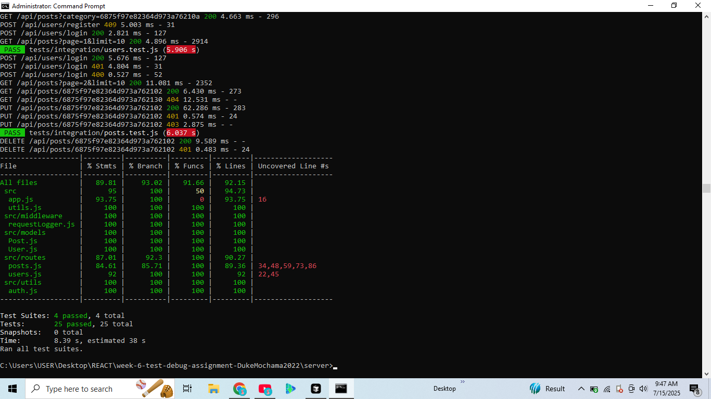
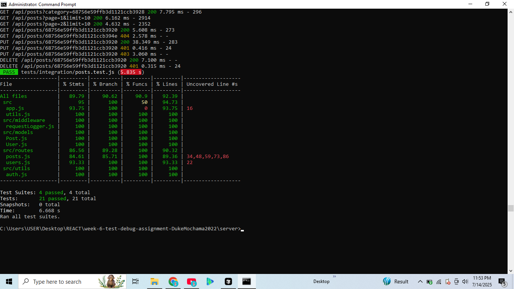
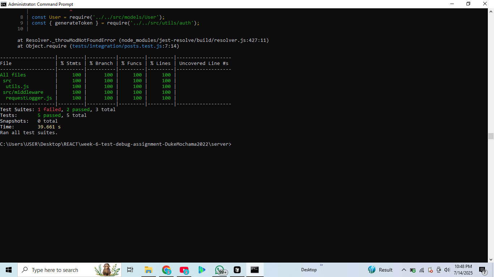
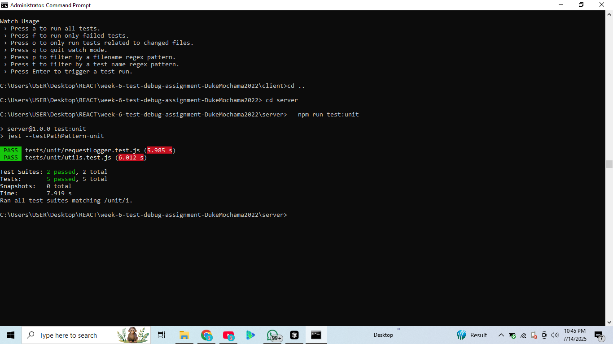
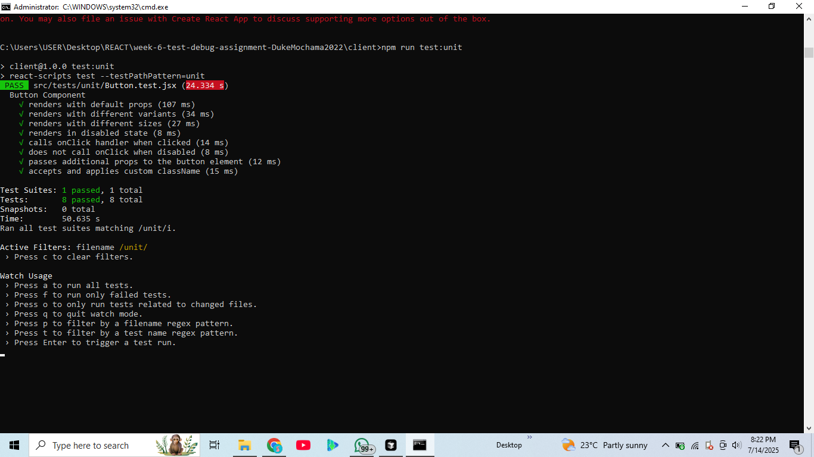
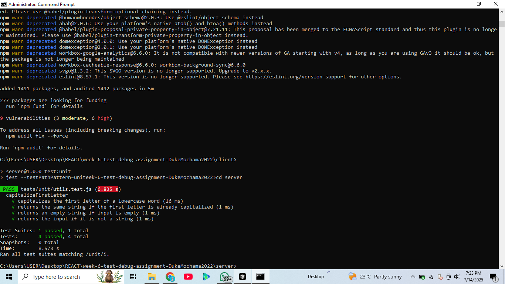

# Test Coverage Screenshots

This document displays screenshots of the test coverage reports for both the backend and frontend of the project.

---

## Screenshot 1

_Caption: Coverage report section 1._

---

## Screenshot 2

_Caption: Coverage report section 2._

---

## Screenshot 3

_Caption: Coverage report section 3._

---

## Screenshot 4

_Caption: Coverage report section 4._

---

## Screenshot 5

_Caption: Coverage report section 5._

---

## Screenshot 6

_Caption: Coverage report section 6._

---

_These screenshots demonstrate the extent of automated test coverage achieved in this project._
